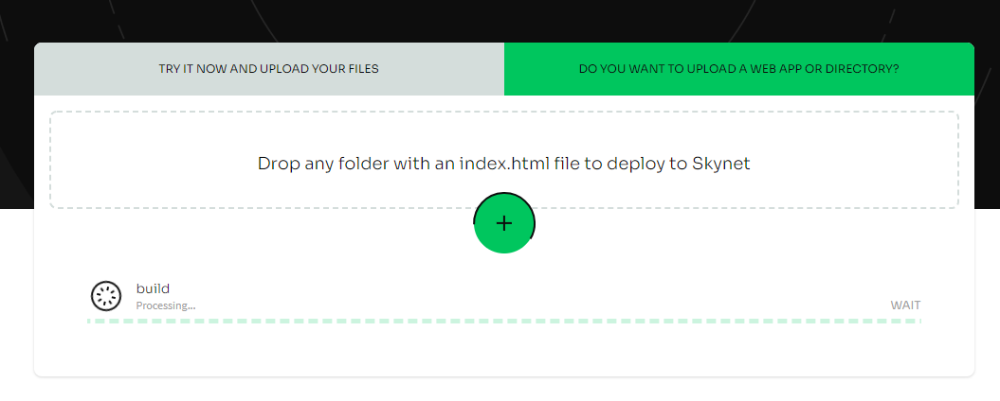

# Setting up a Handshake Name

## 1. Deploy your site hosted on Skynet

1. Go to Siasky.net
2. In the upload widget, select "Do you want to upload a webapp or directory?"
3. Drag-and-drop or click-and-select your website directory or build folder that contains an `index.html` file 

_\[UPDATE THIS LINK TO A FRAMEWORK-FLEXIBLE ROUTING DEPLOY TOOL THAT ALSO GIVES YOUR A BASE-64 SKYLINK\]_

## 2. Aquire a Handshake Name

This is the most difficult part of the process, since it requires obtaining HNS coins. We recommend using [namebase.io](https://www.namebase.io/) to interact with the Handshake ecosystem. See their [Get Handshake Names](https://learn.namebase.io/starting-from-zero/how-to-get-a-name) to learn more about their auctions and marketplace.

Need help, some free HNS coins or just want someone to gift you an HNS? Join the **\#handshake** channel on [our Discord](https://discord.gg/skynetlabs) and we'll answer your questions or get you connected with the great folks over at Namebase.

## 3. Create a Resolver Skylink

Although this can be done with skynet-js, perhaps the easiest way to set a resolver skylink is using the community tool [Rift](https://riftapp.hns.siasky.net/) which will save your data with MySky.

1. Visit the [DNS page](https://riftapp.hns.siasky.net/#/dns)
2. If you're not logged in to MySky, login in the top right.
3. Click the Add DNS Record icon just to the right of "How does this work with Handshake?"
4. Type a label for your resolver skylink \(your HNS name is a good option\) and provide a skylink.
5. Click Save.

## 4. Set your Handshake DNS Records

1. Visit your Namebase Dashboard [Domain Manager](https://www.namebase.io/manage/owned?page=1)
2. Select "Manage" on the Handshake name you want to use
3. On the "Rift DNS" page, click the "Resolver Skylink" for the name you wish to use. This will copy it to your clipboard.
4. Under "Blockchain DNS records," add a new record and set the type to TXT and paste the skylink as the value. Be sure your skylink starts with `sia://`
5. Click "Save" at the bottom, and wait! It could take up to 6 hours.

## 5. Update your Resolver Skylink

Now, if you ever want to update where your resolver skylink points, just return to Rift, click the name of your resolver skylink, and update the "Target Skylink" field and save! Your changes should be immediately available at your HNS name.

### Congratulations! You deployed your first site with Handshake.

You can visit the site at `[name].hns.siasky.net` or replace `siasky.net` with any other Skynet web portal.

