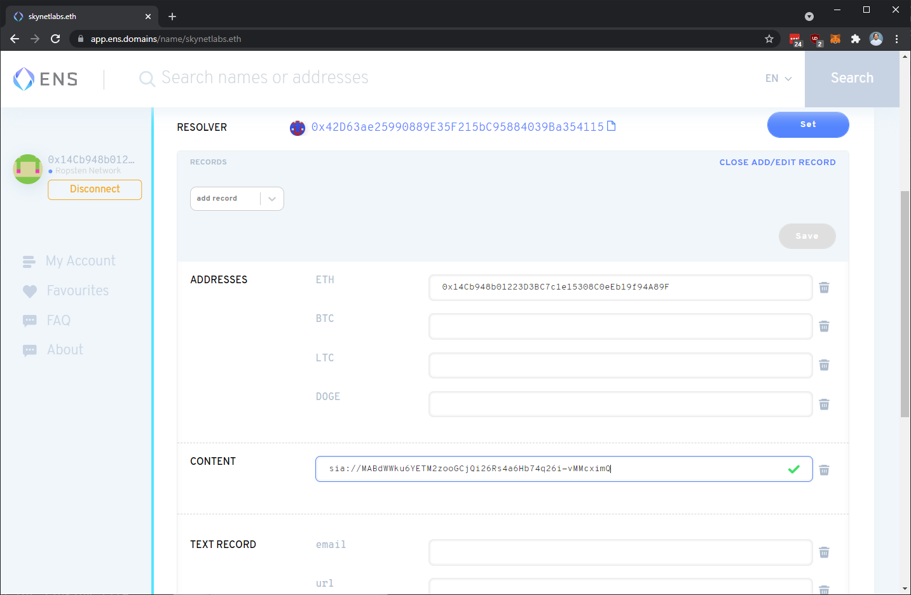
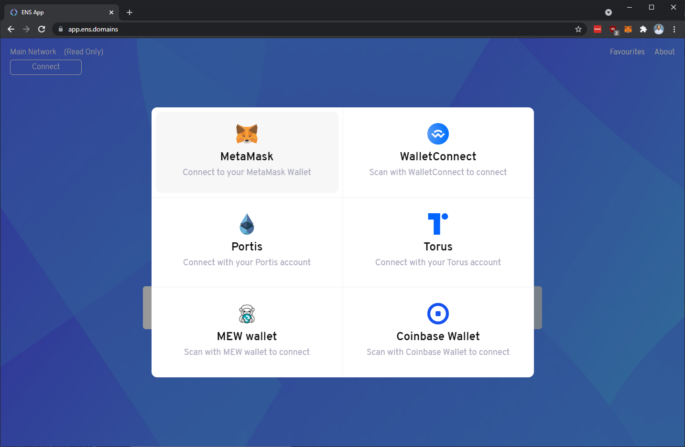
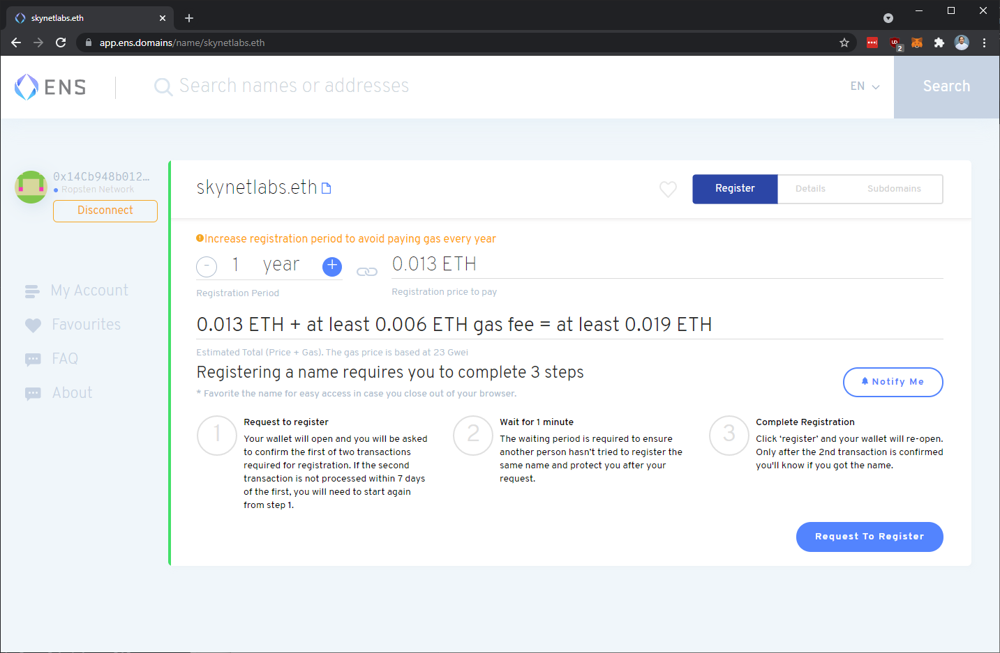
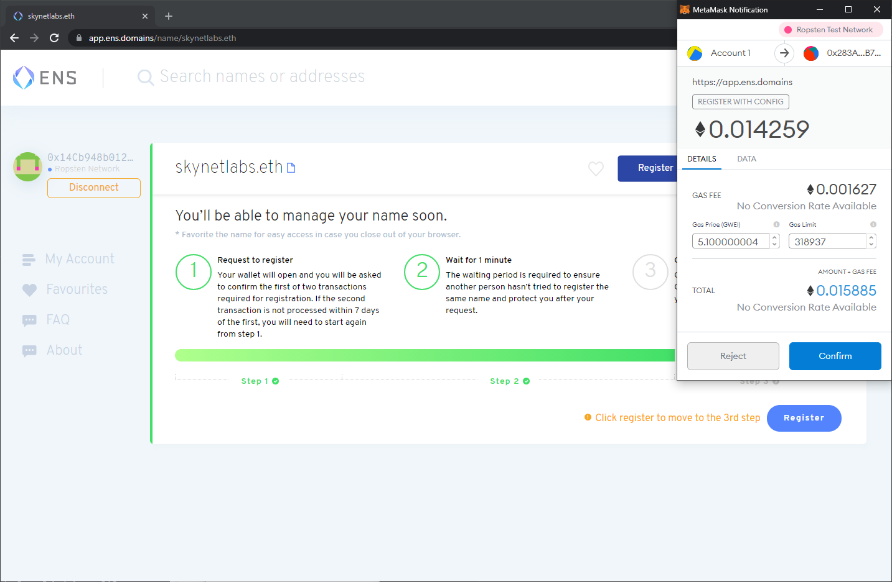
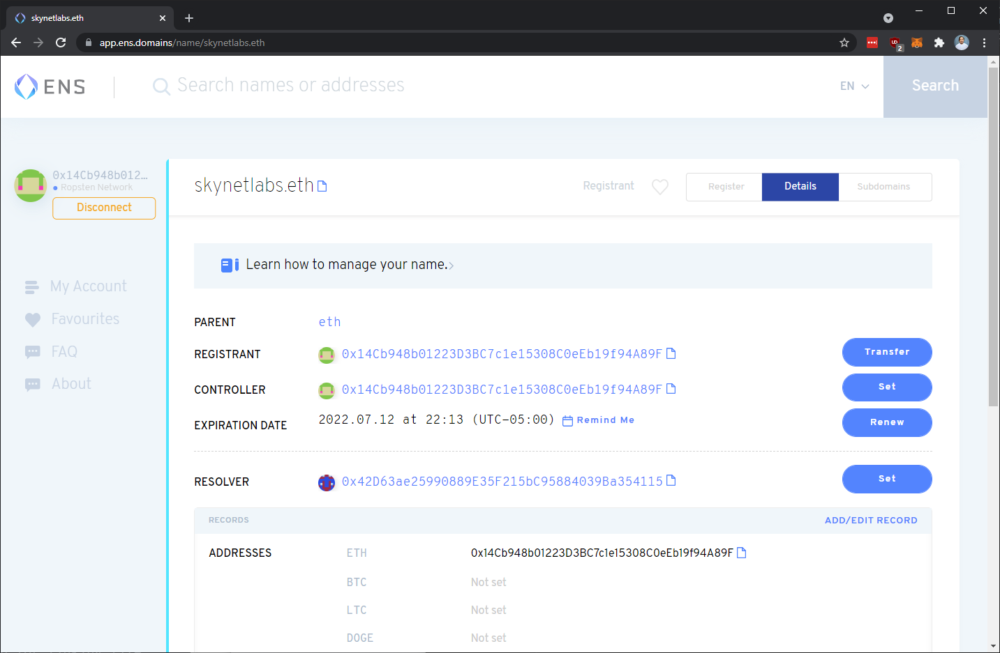
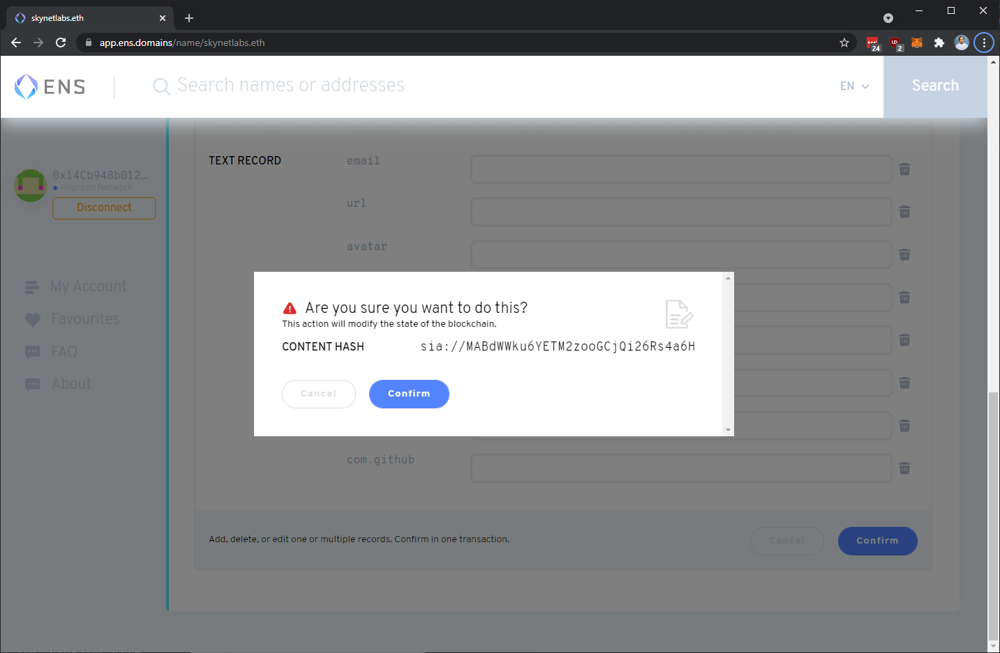

# ENS \(Ethereum Name Service\)

ENS Names are commonly used for identity and domains in the Ethereum ecosystem, and Skynet has broad support in the ENS ecosystem. As they state [in their documentation](https://docs.ens.domains/),

> The Ethereum Name Service \(ENS\) is a distributed, open, and extensible naming system based on the Ethereum blockchain.
>
> ENS’s job is to map human-readable names like ‘alice.eth’ to machine-readable identifiers such as Ethereum addresses, other cryptocurrency addresses, content hashes, and metadata. ENS also supports ‘reverse resolution’, making it possible to associate metadata such as canonical names or interface descriptions with Ethereum addresses.

If you own an ENS name, you can point it to a skylink, then visit your page in a browser that supports ENS domains \(or that has Metamask installed\) or by visiting `[ensName].eth.link` .

## Setting an ENS Name

After you have registered an ENS name, you can edit your record, setting the `Content` record to a skylink starting with `sia://` – see the entry for [skynetlabs.eth](https://app.ens.domains/name/skynetlabs.eth) as an example.


ENS Names can also be controlled by DAOs using multi-sig wallets like [Gnosis Safe](https://medium.com/the-ethereum-name-service/you-can-now-manage-ens-names-with-gnosis-safe-9ddcb7e6c4ac). By using a resolver skylink run by a web team, an organization can grant usage of the domain without having to sign for every re-deploy.


## ENS Support

The following services support Skynet on ENS and will resolve ENS names to an application on Skynet:

* MetaMask Browser Extension \(v10.0.0+\)
* Cloudflare's [Eth.Link](https://eth.link/) resolver

We are working towards support on the following applications:

* MetaMask Mobile App
* Opera
* Brave
* Puma Browser
* Status \(mobile\)


Know of any other applications lacking ENS + Skynet support? Let us know.


## Registering an ENS Name

Unfamiliar with Ethereum ecosystem? If you already have a wallet and some ETH, it'll just take a few steps to register an ENS name.

### 1. Connect a wallet with sufficient funds for the domain and gas

### 2. Find a name, select "Request to Register", then confirm in your wallet

### 3. Wait, then complete registration and confirm

### 4. Visit domain details, select "Add/Edit Record" and input a skylink

#### 5. Enjoy your ENS name!

## Additional Resources

### Generating a ContentHash without the ENS App

If you aren't using the ENS frontend, you'll need to generate a content hash for your skylink.


Users using the official [ENS Domains](https://ens.domains/) site do not need to do this!


* You can insert a Base64 Skylink \(without `sia://`\) into [this tool](https://5g0ab4bfifpa1rcvdainjdc9h6ldmmg4rlgke3rc1g1372mspdeevfg.siasky.net/) to generate one.
* To generate programmatically, use the [ENS Domains fork of content-hash](https://github.com/ensdomains/content-hash) and call `encode("skynet-ns", [skylink])`
* Or, use the widget below.



