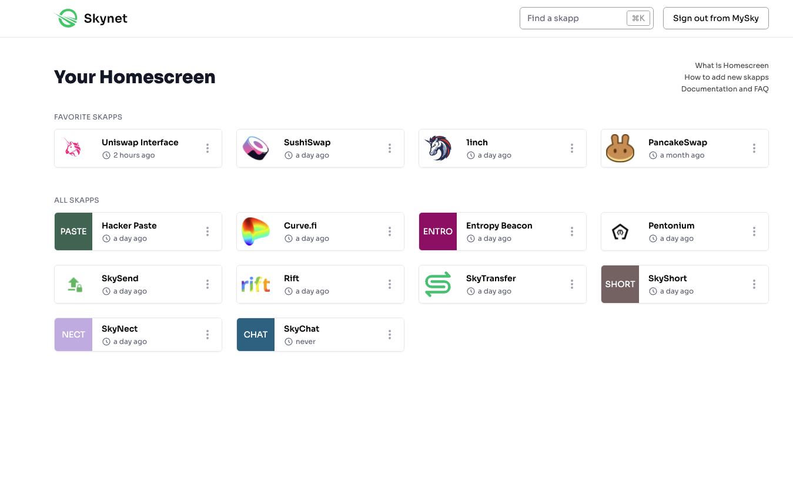

# Homescreen

## Introduction

Homescreen provides a way for users to save immutable versions of application front-ends. We see this as particularly necessary for the DeFi space for additional security and control over access to decentralized protocols and smart contracts.


Homescreen is not yet released. We will be regularly updating this page with the information needed to get your app working with Homescreen.


## Integrating with Homescreen

For developers to add support for Homescreen, they need to do a few things:

* Application front-end supports static deployment \(Gatsby & full React Router support coming soon\)
* Assure APIs depend only on decentralized protocols that will remain accessible with front-end updates
* Add an "Add to Homescreen" button on your project's Releases and README that links to Homescreen

## Explore More







