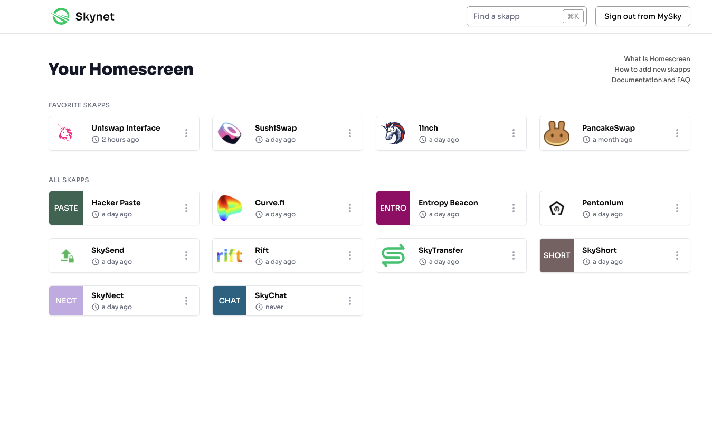

# Homescreen

## Introduction

[Homescreen](https://homescreen.hns.siasky.net/) provides a way for users to save immutable versions of application front-ends. We see this as particularly necessary for the DeFi space for additional security and control over access to decentralized protocols and smart contracts.

To learn more about using Homescreen, see the [Skynet Guide article](https://support.siasky.net/key-concepts/homescreen) on Homescreen.



## How Homescreen Works

### Adding an App

Using either an "Add to Homescreen" button or the input bar at the top of the Homescreen site, users are able to add Skylink to their "Homescreen." If a resolver skylink is used, Homescreen will determine where the resolver skylink currently resolves to. If the user selects "Add to Homescreen," then the content of the immutable skylink is "pinned" to the user's storage.

### Updating and Versioning an App

Updates are made available for apps by using resolver skylinks. If you update where a resolver skylink resolves to, your users will be able save the new url as a "version" of the app.

If an app includes a resolver skylink in the `skylink` field of its [Manifest](adding-homescreen-support-to-an-app.md#3-configure-your-manifest-file), this skylink will be used for grouping saved versions and checking for updates. If no `skylink` field is found, the resolver skylink used when initially adding the app to Homescreen will be used. If the app has no resolver skylink associated with it, updates and versions are not available.

### MySky & Homescreen Storage

In addition to pinning applications to Skynet, Homescreen uses decentralized storage for saving user data. Homescreen saves application data to [MySky Files](../../skynet-topics/mysky-and-dacs/mysky-files.md) which are fully controlled by the user's MySky seed.

## Integrating with Homescreen

For developers to add support for Homescreen, they need to do a few things:

* Confirm the application front-end supports a static deployment on Skynet \(Gatsby & full React Router support coming soon\)
* Assure APIs and web requests from your app only depend on decentralized protocols that will remain accessible even with future front-end updates. For web3, this usually means interacting with MetaMask or a Skynet portal, not making HTTP requests to your centralized back-end server. 
* Add an "Add to Homescreen" button on your project's Releases and README that links to Homescreen


Sites using centralized APIs may still work with Homescreen, but breaking changes to an API might break older builds that users have saved to Homescreen. This is not considered to be a best practice.




## Homescreen Preview

## Explore More







