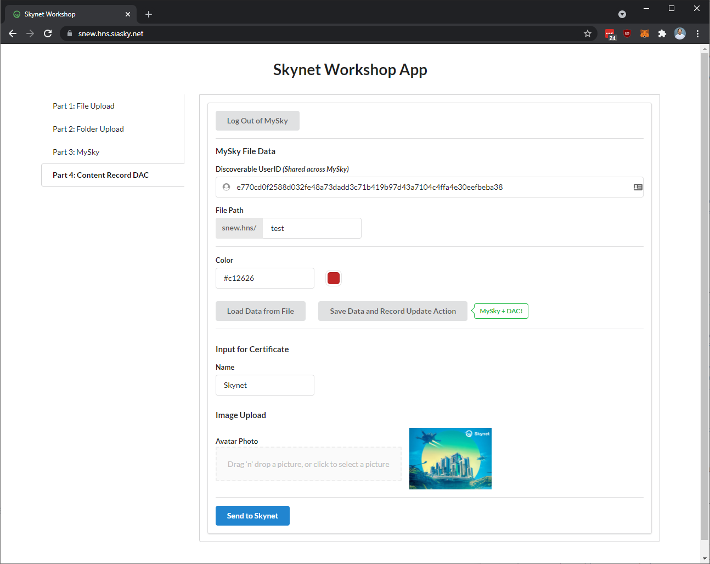

# Introduction Workshop

## Introduction

Our Skynet Workshop is a great place to building web apps with Skynet. The workshop covers the important concepts of developing an app on Skynet, but you may still want to read through the [Getting Started](https://support.siasky.net/getting-started/using-skynet) section of the Skynet Guide.


[Create React App](https://github.com/facebook/create-react-app) is used for structuring the workshop and simplifying deployment, but you don't need any knowledge of React or Javascript to complete it. The project prioritizes new-developer accessibility over production-ready, React best practices.


## What You'll Build

In this workshop, you'll create a web app that interacts with Skynet and can be deployed to Skynet. In each part, we'll add more complex Skynet interactions.

We've already built out the app structure and UI elements so you can focus on Skynet features. By the end, your application will:

* Upload a file to Skynet
* Use this file in a simple webpage it will deploy to Skynet
* Allow MySky users to login and save data to a MySky File that is read by the simple webpage
* Publish each update to the Content Record DAC

By the end, you should have an understanding of each of these pieces and how to leverage these in your code.

[View the completed web app here.](https://snew.hns.siasky.net/) You can interact with each part of the workshop using the tabs at the left.

## Workshop Video

If you prefer video walkthroughs, checkout a recording of a previous workshop along with its [companion site](https://my-sky.hns.siasky.net/) which features helpful widgets for interacting with Skynet.


Some syntax may have changed in latest beta versions of `skynet-js` – please refer to this guide or the [workshop repo](https://github.com/SkynetLabs/skynet-workshop) for up-to-date code samples.




