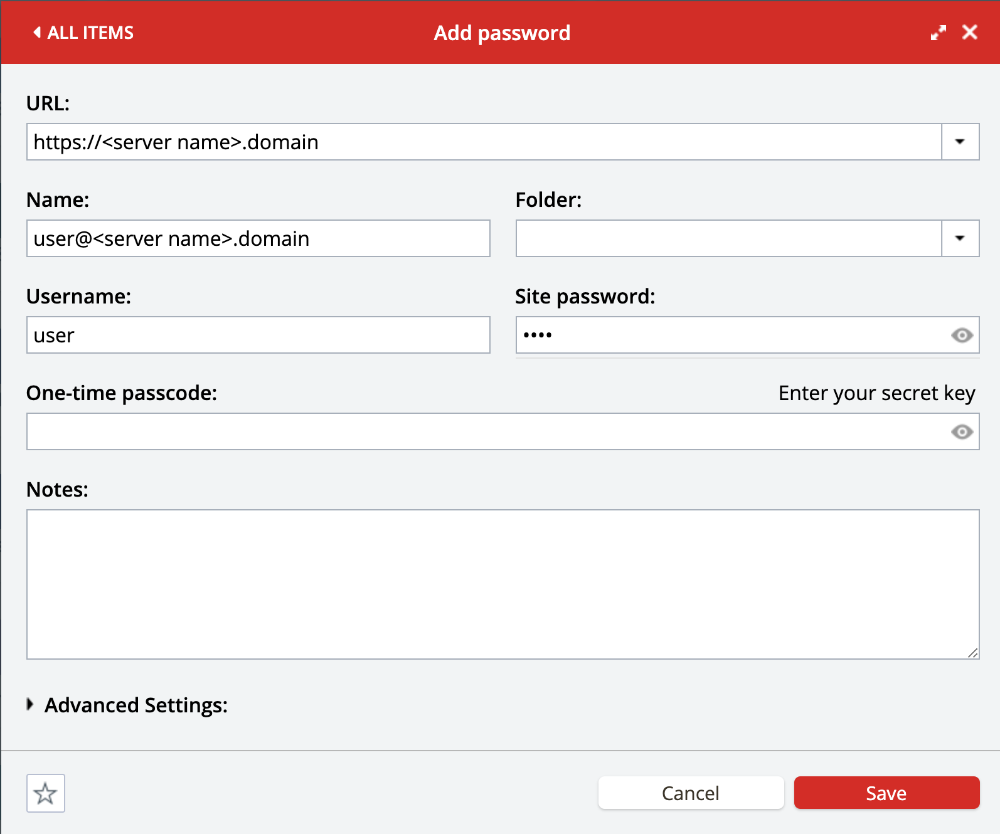

# Server Initialization

## Overview

At the end of this section, you should have the server initialized with a user `user`, and the `root` (or other `sudo`) user removed.

## Prerequisites&#x20;

* All [Prerequisities](server-initialization.md#prerequisites) completed
* [DNS Setup](dns-setup.md) completed

### User credentials in LastPass

Currently you should have `root` (or root like) user access to your server. Ansible will later create a Linux user on your server (with default username `user`).

#### Automatically

Ansible can generate Linux user password and save user credentials to LastPass automatically - in this case you can skip the next chapter.

#### Setting user credentials manually (optional)

You can set user password yourself.

In your LastPass account, you will then need to create an entry for the server as seen below. Updating `<server name>` with the name of your server, i.e. `us-west`, and `domain` with your domain, i.e. `siasky.net`. Ansible will pull this information from LastPass in order to create the user `user` on the server with the provided password.&#x20;

If you are setting up a single server portal you can leave out the server name and just use your domain as you did in the DNS Setup.

This LastPass entry is what is used to create the `user` profile on the server.  Set the `Site password` to a strong password, like one generated from [https://passwordsgenerator.net/](https://passwordsgenerator.net).

### Ansible

Prepare your local machine for running ansible by following the setup requirements [here](https://github.com/SkynetLabs/ansible-playbooks#requirements).

## Portal Setup Initial

To set up the portal, you will need to run the [portal-setup-initial.sh](https://github.com/SkynetLabs/ansible-playbooks#playbook-portals-setup-initial) ansible script. At this point you should have all the prerequisites complete except for:

* Logging in to LastPass with the[ lastpass-login.sh](https://github.com/SkynetLabs/ansible-playbooks#lastpass-login) script
* Adding your server to your `host.ini` file

After successfully running the [portal-setup-initial.sh](https://github.com/SkynetLabs/ansible-playbooks#playbook-portals-setup-initial) script you are ready to continue on to the [Single Portal Setup](single-portal-setup.md).
